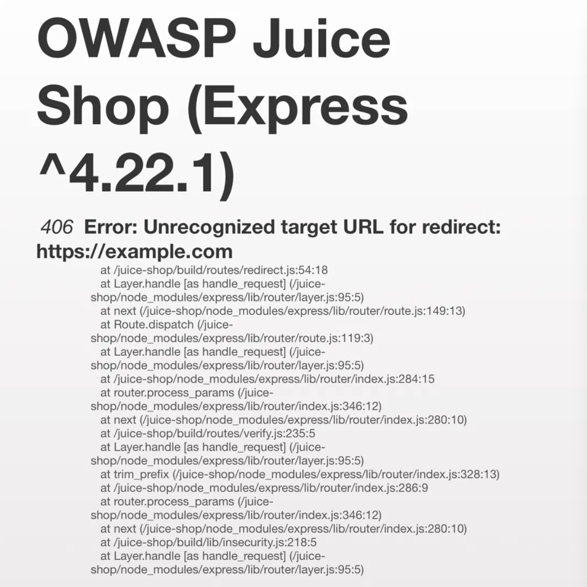
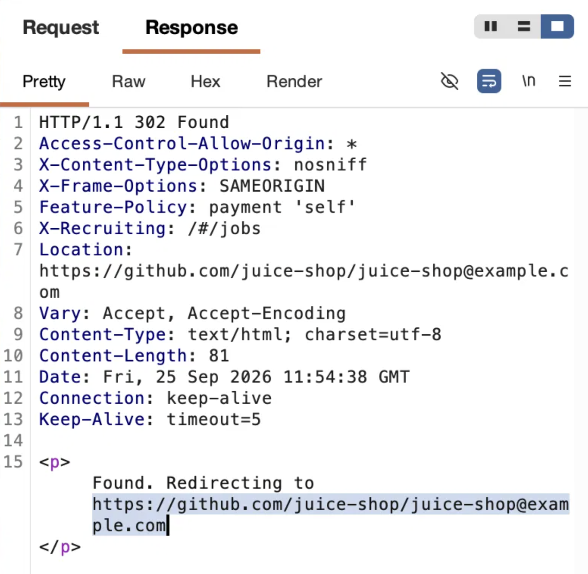
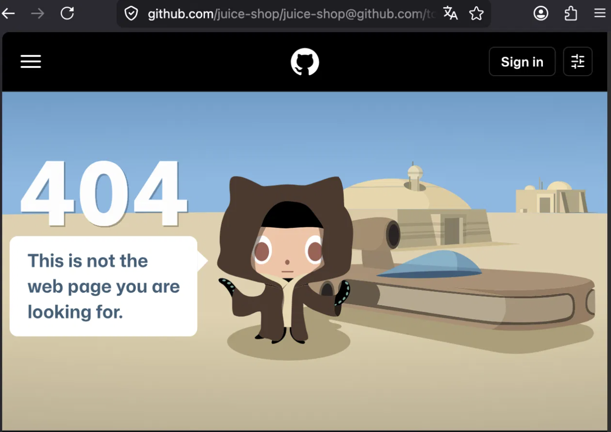

# Open Redirect vulnerability in `/redirect` endpoint (Filter Bypass)

**Target:** OWASP Juice Shop (local instance, `http://localhost:3000`)
**Type:** Unvalidated Redirects and Forwards (Open Redirect)
**CWE:** CWE-601
**Severity:** Medium. The automated scanner (OWASP ZAP) rated this High by default; downgraded to Medium after manual analysis, as Open Redirect primarily enables phishing rather than direct system compromise.

## Description
The application is vulnerable to Unvalidated Redirects and Forwards on the `/redirect` endpoint. The `to` parameter attempts to validate user input against a list of known-good URLs, but the validation is flawed: it only checks whether an allowed string is *present* anywhere in the value. 

An attacker can intercept and modify this parameter, prepending an approved URL to an arbitrary external target using the `@` character. This bypasses the validation logic and forces the server to issue a redirect to an attacker-controlled domain.

## Steps to Reproduce
1. Configure the browser to route traffic through Burp Suite.
2. Navigate to the target application (`http://localhost:3000`).
3. Confirm the direct redirect is blocked by sending:
   `GET /redirect?to=https://example.com`
   *Observe:* The server responds with `406 Unrecognized target URL`, indicating validation is active.
4. Bypass the validation by prepending an allowed URL and appending the attacker target after an `@` character:
   `GET /redirect?to=https://github.com/juice-shop/juice-shop@example.com`
5. Forward the request in Burp Suite.
6. *Observe:* The server now responds with a `302 Found` status, and the `Location` header points to the external domain:
   `Location: https://github.com/juice-shop/juice-shop@example.com`

> **Note on Browser Behavior:** The final destination depends on how the victim's browser parses a URL containing `@` (everything before `@` is treated as basic auth user-info, routing to the host `example.com`). The core vulnerability, however, is server-side: the application generates an unsafe `Location` header.

## Proof of Concept

**1. Прямой редирект на внешний домен заблокирован (`406`):**

**2. Обход через `@`: сервер возвращает `302` с `Location` на внешний домен:**

**3. Обработка `@` в URL на стороне браузера:**

## Impact
This vulnerability can be heavily exploited in phishing campaigns. Attackers can craft malicious links that appear to belong to the trusted `localhost:3000` domain. When users click the link, they are redirected to a malicious site designed to steal credentials or distribute malware, leveraging the trust of the original application.

## Remediation
* **Avoid direct input:** Do not use user-supplied input directly for redirects.
* **Strict Allowlisting:** Validate the full target URL, not just the presence of an allowed substring. Parse the host correctly and compare it against a strict server-side allowlist of approved domains.
* **Indirect References:** Prefer redirecting only to relative paths or use indirect references (e.g., `?to=1` maps to GitHub, `?to=2` maps to Twitter securely on the backend).
